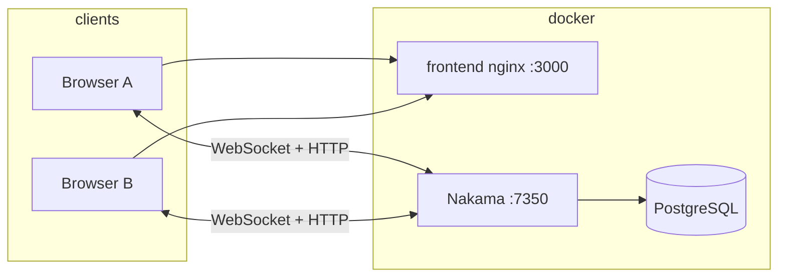

# Triad

Multiplayer tic-tac-toe with a **Nakama** authoritative match handler, **React** client, and **Docker Compose** for local development. Game rules, turns, win/draw, disconnect handling, and optional turn timers are enforced on the server.

## Tech stack

| Layer | Choice |
|--------|--------|
| Game server | Nakama 3.22 (PostgreSQL) |
| Server logic | TypeScript → bundled JS (`nakama-runtime`) |
| Client | React 19, Vite, `@heroiclabs/nakama-js` |
| Local orchestration | Docker Compose |

## Quick start (Docker)

Prerequisites: Docker and Docker Compose.

```bash
docker compose up --build
```

Then:

- **Game UI:** [http://localhost:3000](http://localhost:3000)
- **Nakama API / WebSocket:** `http://localhost:7350` (client default)
- **Nakama console:** [http://localhost:7351](http://localhost:7351) — default credentials are set in `nakama/local.yml` (`admin` / `password`); change these for any shared environment.

Stop with `Ctrl+C` or `docker compose down`. Database data persists in the `triad_pg` volume until you remove it.

## Local development without Docker (optional)

### Nakama module

```bash
cd nakama
npm install
npm run build   # outputs build/index.js
npm test
```

Run Nakama yourself with PostgreSQL and point it at `nakama/local.yml`, with the module file at `nakama/data/modules/build/index.js` (paths may vary by install).

### Frontend (hot reload)

```bash
cp .env.example .env
# Ensure VITE_* values reach the running Nakama (localhost:7350 when ports are published)
cd frontend
npm install
npm run dev
```

Vite serves on port 5173 by default.

## Architecture



1. Players authenticate with **device ID** (anonymous) and a chosen display name.
2. **Create room** or **join by code** uses RPCs (`triad_create_room`, `triad_join_by_code`, `triad_list_open_rooms`) backed by authoritative matches and a small storage-backed room index.
3. **Quick match** uses the Nakama matchmaker; `registerMatchmakerMatched` creates an authoritative match so both players join the same handler.
4. Moves are sent as **match data** (`OpCode.MOVE`). The match loop validates turn, cell, and game status, updates board state, detects win/draw, handles **disconnect grace** and **claim forfeit**, and broadcasts **per-recipient state** (`OpCode.STATE`).
5. **Leaderboard / stats:** After each finished game, wins/losses/draws/streaks are stored in **user storage**; a **leaderboard** (`triad_rank`) is updated for ranked listing (`triad_leaderboard` RPC).

## Docker Compose services

| Service | Role |
|---------|------|
| `postgres` | Nakama database |
| `nakama` | Builds the TS runtime in an image stage, loads `build/index.js`, runs migrations then the server |
| `frontend` | Multi-stage Node build (Vite) + nginx serving static assets on port 3000 |

The browser talks to Nakama at **localhost:7350**, not the Docker service hostname, so the frontend image bakes `VITE_NAKAMA_HOST=localhost` at build time. To target a remote server, rebuild `frontend` with different build args (see `docker-compose.yml`).

## Testing multiplayer locally

1. Start the stack: `docker compose up --build`.
2. Open **two** browser windows (or one normal + one private) at [http://localhost:3000](http://localhost:3000).
3. Sign in with **different names** in each.
4. **Quick match:** start Quick match in both; they should pair into one game.
5. **Rooms:** in window A choose Create room; note the **room code**. In window B use Join with code or refresh **Open rooms** and join.
6. Play moves; confirm illegal moves show an error and the board only updates after server acceptance.
7. Disconnect one tab mid-game: the other side should see disconnect UI, optional **Claim victory**, or auto-forfeit after the grace period.

## Automated tests

```bash
cd nakama && npm test
```

Covers pure move validation, win detection, and draw detection (`src/game_logic.test.ts`).

## Project layout

```
nakama/          TypeScript server module (match handler, RPCs, stats)
frontend/        React SPA
docker-compose.yml
PRD.md           Original product requirements
.env.example     Template for local Vite env vars
```

## Known limitations

- **Deployment:** This repo is optimized for **local** Compose. Production would need TLS, strong console credentials, and likely a reverse proxy.
- **Docker validation:** CI for this environment may not run `docker`; compose files are written to standard Heroic Labs patterns—verify with `docker compose up` on your machine.
- **Match listing:** Open rooms use a storage index plus match label queries; stale entries are pruned when listing or when the second player joins.

## References

- [Nakama documentation](https://heroiclabs.com/docs/nakama/)
- [Authoritative multiplayer](https://heroiclabs.com/docs/nakama/concepts/multiplayer/authoritative/)
- [JavaScript client](https://heroiclabs.com/docs/nakama/client-libraries/javascript/)
