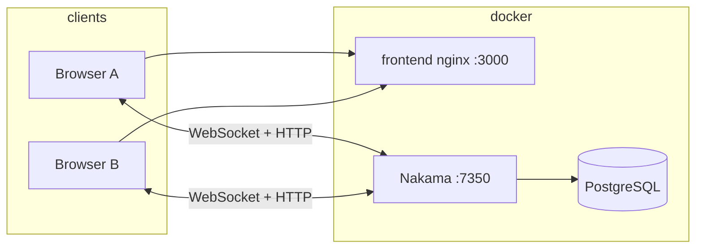

# Triad

**Triad** is a multiplayer tic-tac-toe game built for a server-authoritative, real-time architecture: game rules, turns, win/draw detection, optional **per-turn timers**, **disconnect handling**, and **stats** all run in **Nakama** (TypeScript runtime module). The **React** client uses **`@heroiclabs/nakama-js`** over **HTTP + WebSocket**. **Docker Compose** is the supported way to run Postgres, Nakama, and the built SPA together on your machine.

The original product brief and feature checklist live in [`PRD.md`](./PRD.md).

## What’s in the box

| Area | Behavior |
|------|----------|
| **Auth** | Anonymous **device ID** sessions plus a chosen display name |
| **Matchmaking** | **Quick match** via Nakama matchmaker; **create room** / **join by code** / **open rooms** list via RPCs and storage-backed indexing |
| **Gameplay** | Authoritative match loop: move validation, turn order, win/draw, per-recipient state broadcast |
| **Modes** | **Classic** (no timer) and **Speed** (~30s per turn) with server-side timeout handling |
| **Disconnects** | Grace period, optional **claim forfeit**, server-driven resolution |
| **Leaderboard** | Wins/losses/draws/streaks in user storage; ranked list via RPC |

Server logic lives under `nakama/src` (bundled to `build/index.js`). The client is a **Vite** SPA under `frontend/`.

## Tech stack

| Layer | Choice |
|--------|--------|
| Game server | Nakama **3.22** (`heroiclabs/nakama:3.22.0`, see `nakama/Dockerfile`) |
| Database | PostgreSQL **16** (Alpine image in Compose) |
| Server logic | TypeScript → Rollup bundle (`nakama-runtime` APIs) |
| Client | React **19**, Vite **8**, `@heroiclabs/nakama-js` |
| Local orchestration | Docker Compose (`docker-compose.yml`) |

## Prerequisites

- **Docker** and **Docker Compose** (v2 plugin: `docker compose …`)
- For optional **non-Docker** frontend dev: **Node.js** (see `frontend/package.json` engines if added; otherwise use current LTS)

---

## Run locally with Docker Compose

This is the main path: one command builds the Nakama module image, the Vite→nginx frontend image, and starts Postgres.

### Start the stack

From the **repository root** (where `docker-compose.yml` is):

```bash
docker compose up --build
```

- **`--build`** — rebuild images when you change `nakama/`, `frontend/`, or Dockerfiles.
- First run may take a few minutes (npm install + Nakama image).

**Foreground (default):** logs stream in the terminal; stop with **Ctrl+C** (containers stop; volumes remain).

**Detached (optional):**

```bash
docker compose up --build -d
```

Follow logs:

```bash
docker compose logs -f
# or one service:
docker compose logs -f nakama
```

Stop detached services:

```bash
docker compose down
```

### URLs and ports

After services are healthy:

| What | URL / endpoint |
|------|----------------|
| **Game UI (nginx)** | [http://localhost:3000](http://localhost:3000) |
| **Nakama API + WebSocket** | `http://localhost:7350` (browser must reach this; default client config) |
| **Nakama console** | [http://localhost:7351](http://localhost:7351) |

Console credentials are defined in `nakama/local.yml` (default **`admin` / `password`**). **Change these** before any shared or public deployment.

### Compose services (summary)

| Service | Role |
|---------|------|
| `postgres` | Nakama’s database; data in Docker volume **`triad_pg`** |
| `nakama` | Builds TS runtime in-image, runs migrations, starts Nakama with `local.yml` |
| `frontend` | Multi-stage build: Vite production build + nginx on container port **80**, published as host **3000** |

Local Postgres (from `docker-compose.yml`, **dev only**):

- User: `nakama`
- Password: `localdev`
- Database: `nakama`

### Data persistence and reset

- **`docker compose down`** — stops containers; **volume `triad_pg` keeps DB data** for next `up`.
- **Wipe database data** (destructive):

  ```bash
  docker compose down -v
  ```

  `-v` removes named volumes declared in the compose file (including `triad_pg`).

### How the browser reaches Nakama

The SPA is built with **`VITE_NAKAMA_HOST=localhost`** (and related args in `docker-compose.yml`) so that, with published ports, the **browser** talks to Nakama on the host, not the internal Docker service name `nakama`.

To point the built UI at a **remote** Nakama host, rebuild the `frontend` service with different **`args:`** in `docker-compose.yml` (or your CI), then `docker compose up --build` again.

---

## Local development without Docker (optional)

### Nakama module

```bash
cd nakama
npm install
npm run build   # outputs build/index.js
npm test
```

Run Nakama and Postgres yourself, use `nakama/local.yml`, and install the module at the path your install expects (e.g. under `data/modules/build/` — see `nakama/Dockerfile` for the layout used in Docker).

### Frontend (hot reload)

Used when Nakama is already reachable (e.g. Compose running only `postgres` + `nakama`, or a local Nakama binary):

```bash
cp .env.example .env
# Edit .env so VITE_* matches where the browser will reach Nakama
cd frontend
npm install
npm run dev
```

Vite dev server defaults to **port 5173**. Variables are documented in **`.env.example`**.

---

## Architecture



1. Players authenticate with **device ID** and display name.
2. **Rooms** use RPCs such as `triad_create_room`, `triad_join_by_code`, `triad_list_open_rooms` with authoritative matches and storage indexing.
3. **Quick match** uses the matchmaker; matched players join the same authoritative match handler.
4. Moves use **match data** (`OpCode.MOVE`); the server validates and broadcasts **state** (`OpCode.STATE`).
5. **Leaderboard** uses user storage + leaderboard `triad_rank` and RPC `triad_leaderboard`.

---

## Testing multiplayer locally

1. `docker compose up --build`
2. Open **two** windows (or normal + private) at [http://localhost:3000](http://localhost:3000)
3. Sign in with **different names**
4. **Quick match** in both, or **Create room** / **Join** / **Open rooms**
5. Verify invalid moves are rejected and the board only updates after server acceptance
6. Disconnect one tab: the other side should show disconnect UI / **Claim victory** / timeout behavior

## Automated tests

```bash
cd nakama && npm test
```

Covers move validation, win detection, and draw detection (`src/game_logic.test.ts`).

## Project layout

```
triad/
├── docker-compose.yml    # postgres + nakama + frontend (local)
├── render.yaml           # Render Blueprint: Postgres + Nakama Docker web service
├── .env.example          # Vite env template (local npm run dev)
├── PRD.md                # Product requirements (assignment brief)
├── README.md
├── nakama/               # TypeScript server module, Dockerfile, local.yml
│   ├── entrypoint-render.sh  # Render: migrate + Nakama on $PORT
│   ├── src/
│   └── Dockerfile
└── frontend/             # React + Vite SPA, Dockerfile, vercel.json
    └── src/
```

## Production deploy (Render + Vercel)

Split: **Nakama + Postgres on Render** (long-lived WebSockets), **static SPA on Vercel** (CDN). Order: **backend first**, then point the frontend build at the Render URL.

### Backend (Render)

1. Push this repo to GitHub (`main` includes [`render.yaml`](./render.yaml)).
2. In the [Render dashboard](https://dashboard.render.com/), use **Blueprint** (or **New → Blueprint**) and select **`Gaurav23V/triad`**. Render will create:
   - **Postgres** `triad-db` (free tier; see [Render free limits](https://docs.render.com/docs/free)—including **30-day expiry** for free databases unless upgraded).
   - **Web service** `triad-nakama` (Docker build from `./nakama/Dockerfile`, context `./nakama`) with **`DATABASE_URL`** injected from the database.
3. Wait until the web service is **Live** and note its URL, e.g. `https://triad-nakama.onrender.com` (exact hostname is assigned by Render).

The image uses [`nakama/entrypoint-render.sh`](./nakama/entrypoint-render.sh): runs migrations, then starts Nakama with **`-socket.port $PORT`** (Render’s dynamic port).

**CLI:** `render blueprints validate render.yaml` checks the file. `render workspace set …` and `render services list` / `render logs` help debug deploys.

### Frontend (Vercel)

From [`frontend/`](./frontend/) (after `source ~/.bashrc` if `vercel` is not on `PATH`):

```bash
cd frontend
vercel link          # link to a Vercel project (create one if needed)
```

Add **Production** environment variables (Vite inlines them at **build** time):

| Variable | Example / note |
|----------|----------------|
| `VITE_NAKAMA_HOST` | Hostname only from Render, e.g. `triad-nakama-xxxx.onrender.com` |
| `VITE_NAKAMA_PORT` | `443` |
| `VITE_NAKAMA_USE_SSL` | `true` |
| `VITE_NAKAMA_SERVER_KEY` | Must match Nakama (default in `local.yml` / client is `defaultkey` for demos—change for real production) |

```bash
vercel env add VITE_NAKAMA_HOST production
# … repeat for each variable
vercel deploy --prod
```

[`frontend/vercel.json`](./frontend/vercel.json) sets the Vite framework preset, build command, and `dist` output.

### Deployed URLs (this repo)

| Piece | URL |
|--------|-----|
| **Game (Vercel)** | *Set after you deploy—your `*.vercel.app` or custom domain* |
| **Nakama (Render)** | *Your `triad-nakama` service URL from the Render dashboard* |

Update the table above after deploy so others know where to play.

### Free-tier caveats

- Render **free web** services **spin down** after idle time; first request after sleep can take ~1 minute.
- Render **free Postgres** has a **30-day** lifetime unless upgraded ([docs](https://docs.render.com/docs/free)).
- Use **TLS** (`wss` / `https`) in production; change **console** and **server** secrets away from local defaults for anything public.

## Known limitations

- This repo is **optimized for local Compose**; production needs hardening (secrets, TLS, firewall rules).
- **Open rooms** use storage + match metadata; stale entries are pruned on list/join paths.
- CI may not run Docker; validate Compose on your machine.

## References

- [Nakama documentation](https://heroiclabs.com/docs/nakama/)
- [Authoritative multiplayer](https://heroiclabs.com/docs/nakama/concepts/multiplayer/authoritative/)
- [JavaScript client](https://heroiclabs.com/docs/nakama/client-libraries/javascript/)
